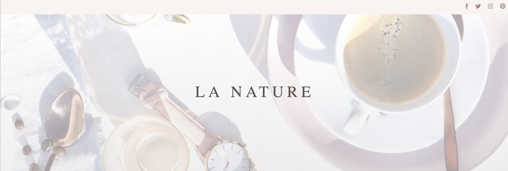

# LA NATURE

LA NATURE is a original Wordpress blog theme that I designed and developed.

## Major skills for development

- HTML5
- CSS3/SCSS
- PHP
- JavaScript
- Gulp
- Wordpress

## Design

My design steps.

### 1.Research and Planning. - Who are target users?

- Travel, Lifestyle, Fashion bloggers.
- Readers who read this blog.

### 2. Set the goal - What's the goal?

- Make a blog theme which catches eyes of bloggers and readers.
- Make a theme which bloggers can show their pictures beautifully.

### 3. Wireframing

- Used Sketch for wireframing and whole designing.

### 4. Design

- Carefully picked images for header for first view.
- Pay attention to Font-family, Font-size, colors and shapes.

### 5. Design Review

- I usually ask designers to get feedback.
- Modify my design depending on feedback.

## Development

### SASS & Gulp

I used SASS as a CSS processor and Gulp as a task runner. It helped me a lot to code stylesheet much faster and I easily could make reuseable variables and Mixins.

### Wordpress
I started coding for making a blog layout first, then added PHP codes to generate such as Header Menu, Sidebar, Thumbnails, Articles, Search Bar, SNS share for Wordpress use. 

## The more things To Do
* Add animation with CSS or JavaScript.
* Add Popular Posts.
* ADD Instargram API.
* Optimize SEO.

